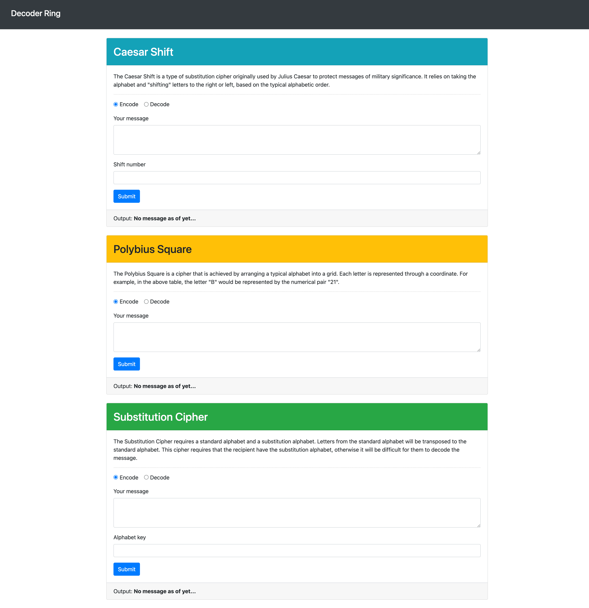
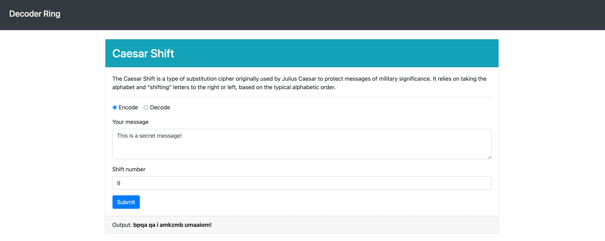
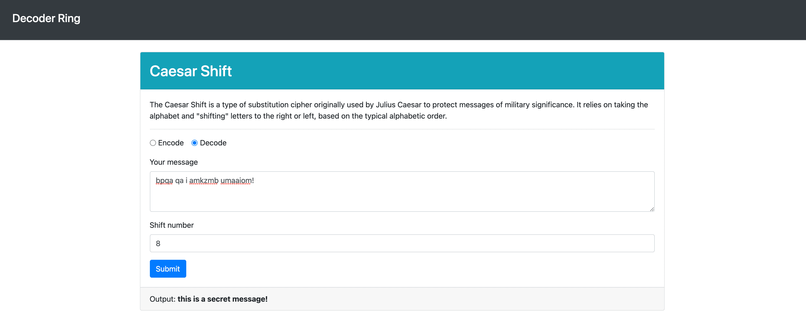
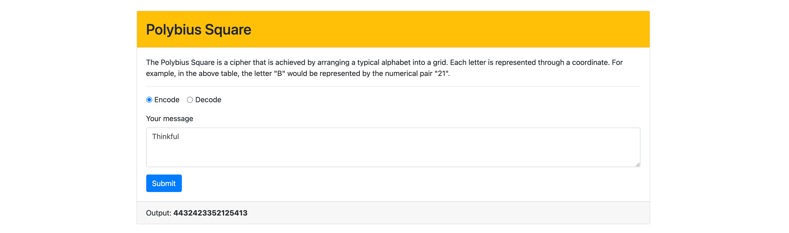
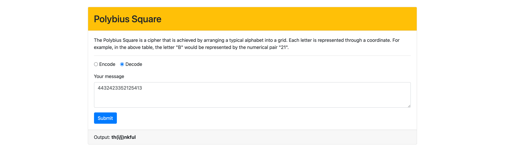
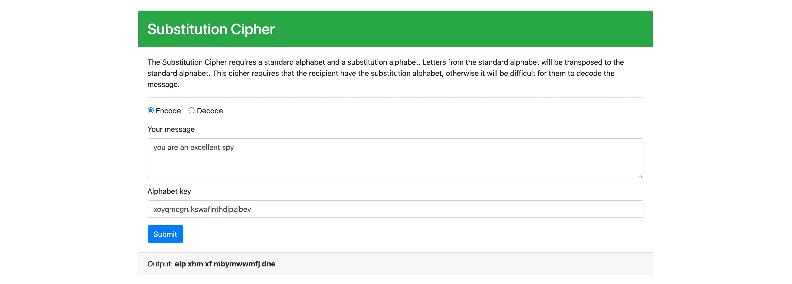
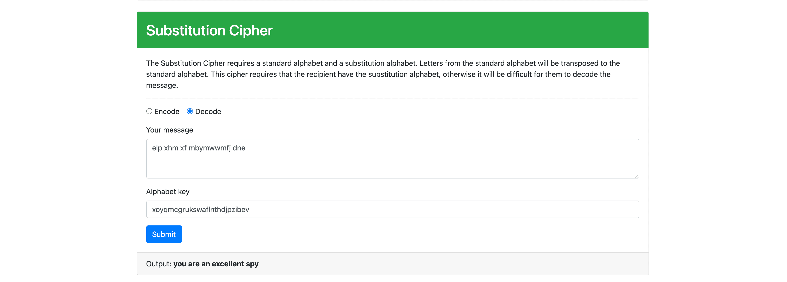

# 🕵🏻‍♀️ Decoder Ring

**⭐ JavaScript Project for Thinkful's Software Engineering program ⭐**

**❗ Project Prompt:**

You are planning a surprise birthday party for one of your friends who loves escape rooms and puzzles. What better way to practice your new coding skills then to build an application that will help you encode and decode all kinds of fun messages?

This project is designed to test your ability to build tricky algorithms as well as write unit tests with Mocha and Chai. Before taking on this module, you should be comfortable with the following:

- Installing packages via NPM
- Modifying the ```package.json``` file with new scripts
- Running tests from the command line
- Writing JavaScript functions
- Writing tests for specific functions
- Iterating through strings, objects, and arrays
- Debugging through reading errors and using the VSCode debugger

You are tasked with building functions for an application that will either encode or decode a string using a variety of ciphers. For each cipher, you should make a series of tests using Mocha and Chai to confirm that your cipher works.

You will need to build 3 Ciphers: Ceasar Shift, Polybius Square, and a Substitution Cipher.

### Ceasar Shift


The Caesar shift is a type of substitution cipher originally used by Julius Caesar to protect messages of military significance. It relies on taking the alphabet and "shifting" letters to the right or left, based on the typical alphabetic order.

For example, if you were to "shift" the alphabet to the right by 3, the letter ```A``` would become ```D```.

```
"thinkful" -> "wklqnixo"
```

When decoding the message, you need to know the number the original message was shifted by so that you can shift in the opposite direction.


### Polybius Square


The Polybius square is a cipher that is achieved by arranging a typical alphabet into a grid. Each letter is represented through a coordinate. For example, in the above table, the letter B would be represented by the numerical pair 21.

Typically, it is possible to arrange the letters however you like and read off the coordinates in whatever direction you like. In this example, the grid will be arranged as above and coordinates will be read by comparing the first digit to the number on the top of the table and the second digit to that on the left.

```
"thinkful" -> "4432423352125413"
```

When decoding the message, each pair of numbers is translated using the coordinates.


### Substitution Cipher


The substitution cipher requires a standard alphabet and a substitution alphabet. Letters from the standard alphabet will be transposed to the standard alphabet. This cipher requires that the recipient have the substitution alphabet, otherwise it will be difficult for them to decode the message.

For example, in the image above, the word ```HELLO``` would be translated as follows:

- ```H``` becomes ```R```.
- ```E``` becomes ```M```.
- ```L``` becomes ```W```.
- ```O``` becomes ```L```.

This would result in the code ```RMWWL```. To decrypt this code, you would simply take the result and transpose back from the substitution alphabet to the standard alphabet.
## ⭐️ Demo

⭐️ [click here for live preview](https://decoder-ring-project-seven.vercel.app/) ⭐️


## 💻 Tech Stack

- JavaScript
- HTML
- CSS
- Mocha
- Chai


## Screenshots

### 🧩 Full Homepage View


### 🧩 Ceasar Shift
#### Encode a Message


#### Decode a Message



### 🧩 Polybius Square
#### Encode a Message


#### Decode a Message



### 🧩 Substitution Cipher
#### Encode a Message


#### Decode a Message



## 🖥 Run Locally

Clone the project

```bash
  git clone https://github.com/nikki-mac/decoder-ring-project.git
```

Go to the project directory

```bash
  cd decoder-ring-project
```

Install dependencies

```bash
  npm install
```

Start the server

```bash
  npm start
```


## 📈 Running Tests

To run tests, run the following command

```bash
  npm run test
```


## 📓 Project Requirements and Acceptance Criteria

### Ceasar Shift

#### Acceptance Criteria:
The ```caesar()``` function in the ```src/caesar.js``` file has three parameters:

- ```input``` refers to the inputted text to be encoded or decoded.
- ```shift``` refers to how much each letter is "shifted" by. A positive number means shifting to the right (i.e., ```A``` becomes ```D```) whereas a negative number means shifting to the left (i.e., ```M``` becomes ```K```).
- ```encode``` refers to whether you should encode or decode the message. By default it is set to ```true```.

When building the function, keep the following constraints and rules in mind:
- If the ```shift``` value isn't present, equal to ```0```, less than ```-25```, or greater than ```25```, the function should return ```false```.
Spaces should be maintained throughout, as should other nonalphabetic symbols.
Capital letters can be ignored.
If a letter is shifted so that it goes "off" the alphabet (e.g., a shift of 3 on the letter ```z```), it should wrap around to the front of the alphabet (e.g., ```z``` becomes ```c```).

Examples:
```
caesar("thinkful", 3); //> 'wklqnixo'
caesar("thinkful", -3); //> 'qefkhcri'
caesar("wklqnixo", 3, false); //> 'thinkful'

caesar("This is a secret message!", 8); //> 'bpqa qa i amkzmb umaaiom!'
caesar("BPQA qa I amkzmb umaaiom!", 8, false); //> 'this is a secret message!'

caesar("thinkful"); //> false
caesar("thinkful", 99); //> false
caesar("thinkful", -26); //> false
```

For the Caesar shift (example: ```caesar("Zebra Magazine", 3) => "cheud pdjdclqh"```), the tests that you write should test that the following is true:

- It returns ```false``` if the shift value is equal to ```0```, less than ```-25```, greater than ```25```, or not present.
- It ignores capital letters. (For example, the results of ```A Message``` and ```a message``` should be the same.)
- When encoding, it handles shifts that go past the end of the alphabet. (For example, shifting ```z``` to the right by ```3``` should cause the ```z``` to wrap around to the front of the alphabet, so that ```z``` becomes ```c```.)
- It maintains spaces and other nonalphabetic symbols in the message, before and after encoding or decoding.

### Polybius Square

#### Acceptance Criteria

The ```polybius()``` function in the ```src/polybius.js``` file has two parameters:

- ```input``` refers to the inputted text to be encoded or decoded.
- ```encode``` refers to whether you should encode or decode the message. By default it is set to ```true```.

When building the function, keep the following constraints and rules in mind:
- You are welcome to assume that no additional symbols will be included as part of the input. Only spaces and letters will be included.
- When encoding, your output should still be a string.
- When decoding, the number of characters in the string excluding spaces should be even. Otherwise, return ```false```.
- Spaces should be maintained throughout.
- Capital letters can be ignored.
- The letters ```I``` and ```J``` share a space. When encoding, both letters can be converted to ```42```, but when decoding, both letters should somehow be shown.

Examples:
```
polybius("thinkful"); //> "4432423352125413"
polybius("Hello world"); //> '3251131343 2543241341'

polybius("3251131343 2543241341", false); //> "hello world"
polybius("4432423352125413", false); //> "th(i/j)nkful
polybius("44324233521254134", false); //> false
```

For the Polybius square (example: ```polybius("message") => "23513434112251"```), the tests that you write should test that the following is true:

- When encoding, it translates the letters ```i``` and j to ```42```.
- When decoding, it translates ```42``` to ```(i/j)```.
- It ignores capital letters. (For example, the results of ```A Message``` and ```a message``` should be the same.)
- It maintains spaces in the message, before and after encoding or decoding.

### Substitution Cipher

The ```substitution()``` function in the ```src/substitution.js``` file has three parameters:

- ```input``` refers to the inputted text to be encoded or decoded.
- ```alphabet``` refers to substitution alphabet.
- ```encode``` refers to whether you should encode or decode the message. By default it is set to ```true```.

When building the function, keep the following constraints and rules in mind:

- The ```input``` could include spaces and letters as well as special characters such as ```#```, ```$```, ```*```, etc.
- Spaces should be maintained throughout.
- Capital letters can be ignored.
- The ```alphabet``` parameter must be a string of exactly 26 characters, which could include special characters such as ```#```, ```$```, ```*```, etc. Otherwise, it should return ```false```.
- All the characters in the ```alphabet``` parameter must be unique. Otherwise, it should return ```false```.

Examples:
```
substitution("thinkful", "xoyqmcgrukswaflnthdjpzibev"); //> 'jrufscpw'
substitution("You are an excellent spy", "xoyqmcgrukswaflnthdjpzibev"); //> 'elp xhm xf mbymwwmfj dne'
substitution("jrufscpw", "xoyqmcgrukswaflnthdjpzibev", false); //> 'thinkful'

substitution("message", "$wae&zrdxtfcygvuhbijnokmpl"); //> "y&ii$r&"
substitution("y&ii$r&", "$wae&zrdxtfcygvuhbijnokmpl", false); //> "message"

substitution("thinkful", "short"); //> false
substitution("thinkful", "abcabcabcabcabcabcabcabcyz"); //> false
```

For the substitution cipher (example: ```substitution("message", "plmoknijbuhvygctfxrdzeswaq") => "ykrrpik"```), the tests that you write should test that the following is true:

- It returns ```false``` if the given alphabet isn't exactly 26 characters long.
- It correctly translates the given phrase, based on the alphabet given to the function.
- It returns ```false``` if there are any duplicate characters in the given alphabet.
- It maintains spaces in the message, before and after encoding or decoding.
- It ignores capital letters. (For example, the results of ```A Message``` and ```a message``` should be the same.)

